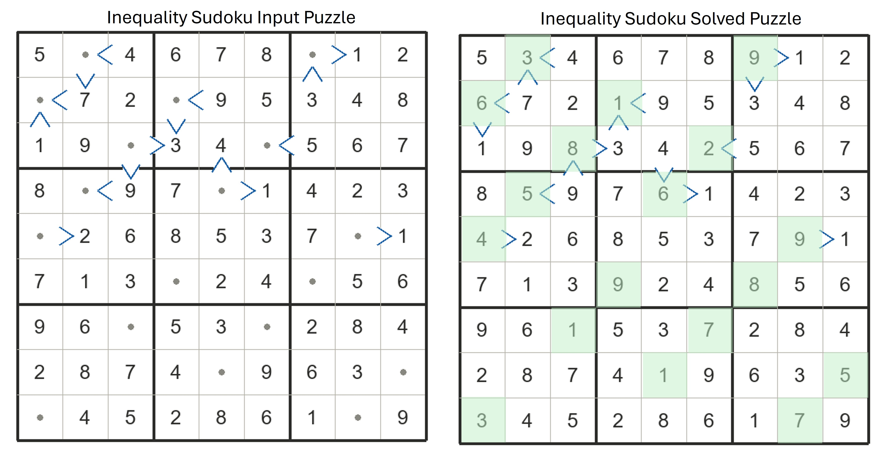
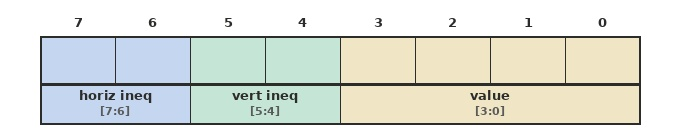

# DDP26-Summer Hackathon Challenge

This document outlines both the Hackathon challenge and the project deliverables, introducing a Sudoku variant to be implemented using the knowledge and infrastructure built up throughout the course.

## The Sudoku Inequality Variant Challenge

In addition to the standard Sudoku constraints, the solver also enforces **inequality relations** between neighboring cells wherever indicated. As illustrated in the example below, each such constraint requires one cell to be strictly less than or greater than its neighbor. The solution must satisfy both the standard Sudoku rules and all inequality constraints simultaneously.

Inequalities are optional, they may be assigned to any subset of cell borders, or to none at all. A board with no inequalities reduces to a standard Sudoku and should be fully supported. On the other hand, a board with few or no given digits but a rich set of inequalities is also valid; the inequalities alone may be sufficient to determine a unique solution.


## Board Input Encoding




### Fields

| Bits | Field | Meaning |
|------|-------|---------|
| `[3:0]` | **value** | Cell digit — `0` = empty, `1`–`9` = given or solved digit |
| `[5:4]` | **vert ineq** | Constraint between this cell and the cell **below** |
| `[7:6]` | **horiz ineq** | Constraint between this cell and the cell to the **right** |

### Inequality Codes

| Code | Binary | Constraint |
|------|--------|------------|
| `0` | `00` | No constraint |
| `1` | `01` | Less-than — this cell **<** neighbour |
| `2` | `10` | Greater-than — this cell **>** neighbour |
| `3` | `11` | No constraint *(same as `00`)* |

### Example

A cell holding the digit **5**, constrained to be *less than* the cell to its right and *greater than* the cell below, encodes as:

```
  horiz = 01  (less-than right)
  vert  = 10  (greater-than below)
  value = 0101  (digit 5)

  byte  = 01 10 0101  =  0x65
```

### Constraint Direction

Each constraint is **outgoing**, it describes the relationship from the current cell to its neighbor, not the other way around. The neighbor's incoming constraint is therefore implicit and never stored twice.

> Cells on the **bottom row** have no cell below; their `vert` field is ignored.  
> Cells on the **rightmost column** have no cell to the right; their `horiz` field is ignored.

## K5_XBOX Sudoku Environment — Input File Format
The input puzzle file format extends the standard Sudoku solver format: the upper nibble of each byte (a *nibble* being a 4-bit value) is no longer zero but instead encodes the cell's inequality constraints as described above.

As an example, the file below corresponds to the puzzle image above. Consider cell `[0,1]`: it holds `0x50` (`0b01_10_0000`), encoding a horizontal `<` constraint with the cell to its right and a vertical `>` constraint with the cell below.

```
05 50 04 06 07 08 a0 01 02
60 07 02 50 09 05 03 04 08
01 09 90 03 04 60 05 06 07
08 40 09 07 80 01 04 02 03
80 02 06 08 05 03 07 80 01
07 01 03 00 02 04 00 05 06
09 06 00 05 03 00 02 08 04
02 08 07 04 00 09 06 03 00
00 04 05 02 08 06 01 00 09
```

## Environment Setup
To support the inequality variant you need to update the shared library C code with inequality board loading and output verification, and obtain the inequality test boards. Run the following commands **once**:

```bash
tsmc65
git clone https://github.com/DDP26-summer/hackathon
mv my_k5_proj/sw/apps/sud_shared my_k5_proj/sw/apps/sud_shared_PRE_HKTN_BACKUP
cp -r hackathon/my_k5_proj_ref/sw/apps/sud_shared my_k5_proj/sw/apps
```
> The third command backs up your current `sud_shared` folder before overwriting it.

### Windows/MAC FPGA environment adjustment

Some features have been added to the Windows environment. Before running your FPGA project, please update your Git Bash environment as follows:

```
cd $K5X_WIN/k5_xbox_fpga_win
git pull
```


## C Code Adjustment

In your application `main()`, replace the entire block beginning with `if (solved)  ... else ...` with the following:

```c
 if (solved) verify(board);
 else printf("\nApp reported non-solved.\n");
```
You may optionally apply this checker update to the standard Sudoku project as well, since the inequality variant format is fully backwards compatible with it.

## Invocation
The examples below assume your application and accelerator are named `ineqsudx_scan`. Since the inequality variant must also handle boards with no inequalities, and the standard board format is fully compatible, you may test existing boards as a first sanity check.

**Application terminal**
```bash
set_k5_terminal
launch_k5_app ineqsudx_scan -asl sud_shared -gpv 20blanks
```
**Simulation terminal** *(skip if running on FPGA)*
```bash
set_k5_terminal
launch_k5_sim ineqsudx_scan
```
To run boards with inequalities, a dedicated subfolder has been added. The following example corresponds to the puzzle shown above:

```bash
launch_k5_app ineqsudx_scan -asl sud_shared -gpv ineq/set0/sparse1
```
### COOL: Display cycle count on FPGA board
**Applicable only to FPGA execution:** You can display the achieved cycle count on the FPGA board’s 7-segment LED display by adding `-ccd1 DISP7S` to your command. For example:


```bash
launch_k5_app ineqsudx_scan -asl sud_shared -gpv hard1 -ccd1 DISP7S
```

## Maintaining Multiple versions

Despite the standard Sudoku compatibility guarantee, it is strongly recommended to keep your current working implementation intact rather than embedding inequality support directly into it.

Multiple versions of both the application C code and the accelerator Verilog can coexist, simply give each a unique name under `sw/apps` and `hw/xlrs` respectively, then reference the appropriate version in your simulation, synthesis, and FPGA bitstream (`sof`/`svf`) build, programming, and execution commands.

## Development Tips *(optional)*

- Start by verifying that your current solution handles boards without inequalities correctly, then gradually extend it to enforce the inequality constraints.
- Back up stable or well-progressing versions regularly — you may need to revert if a development path turns out to be a dead end.
- The more advanced your standard Sudoku solution, the harder it may be to migrate it to the inequality variant. You are therefore free to implement the variant on top of any baseline, or as a completely independent solution from scratch. AI assistance is permitted.
- As with the standard Sudoku, a fully hardware-computed solution is likely feasible for scan-based and MRV approaches, though MRV may come at the cost of a lower achievable clock rate.


## Applied Test Cases

Performance scores for both the project and the hackathon will be measured against a set of seen and unseen boards, with the majority being unseen and of approximately "hard1" difficulty. The unseen boards will be released on the day of the hackathon event.

All provided boards are guaranteed to be legal and to yield a valid solution. The output board is expected  be confirmed as correct by the code checker.

Each board is tested in a separate invocation with no need to support multiple boards within a single execution.

## Scoring

Note that while you are required to provide a functional variant solution, the overall performance, competitive and project scores will mostly be based on the current pre-variant performance.

The Sudoku solving time is determined by the reported cycle count and multiplied by the accelerator achieved clock period, which can be expressed as:

> **Solve time (µs) = cycle count / maximum frequency (MHz)**

```text
solve_time_us = cycle_count / max_freq_mhz
```
To neutralize the platform infrastructure speed bottleneck, the `max_freq_mhz` value should be taken from the **standalone accelerator synthesis** using the `qsyn_xlr` utility, rather than from the full-design `comp_fpga` result.

### Limitations
- You are not allowed to modify any of the infrastructure shared sources and scripts other than the sources maintained under $MY_K5_PROJ area.
- You may not use Quartus FPGA advanced optimization synthesis features or components not introduced in guides, you may use only provided synthesis scripts.


> **AI assistance:** You may use AI tools to assist with your development, as long as you reasonably understand the generated code and can explain your solution.

As detailed in the scoring tables below, competitive hackathon performance is scored mostly on an absolute basis. For project grading, however, we recognize that different baseline choices yield significantly different performance ranges, so the majority of the project score will be relative to the chosen baseline and the effort invested in improving it, with absolute performance and solution sophistication considered to a lesser extent.

## Hackathon Competitive Scoring

| Item | Weight |
|---|---:|
| Standard Sudoku absolute performance | 40% |
| Standard Sudoku complete Functionality (see note)  | 10% |
| Inequality Sudoku absolute performance | 10% |
| Inequality Sudoku complete functionality (see note) | 40% |
| **Total** | **100%** |

NOTE: It is assumed that competition candidates have a fully functional solution running in both simulation and on FPGA across all test cases. Major functional failures disqualify the solution entirely, while minor corner-case gaps may result in a partial score reduction up to the indicated percentage.
## Project  Grading (as part of course final grade)

| Category | Item | Weight |
|---|---|---:|
| **Baseline** | SUDX baseline functional in simulation | 5% |
| | SUDX baseline functional on FPGA | 10% |
| **Project** | Solved in simulation | 10% |
| | Demonstrated on FPGA | 10% |
| | Improved performance vs applied baseline | 30% |
| **Hackathon** | Variant solved in simulation | 10% |
| | Variant demonstrated on FPGA | 10% |
| **Submission** | Overall code quality and understanding | 10% |
| | Project & Hackathon report | 5% |
| | **Total** | **100%** |

## Hackathon Competitive Awards and Recognition

The top three places will receive awards, with prizes to be confirmed. Additional recognition may be given for outstanding creativity, exceptional dedication, or other notable contributions.

All participants will receive a digital "Successful Hackathon Participant" certificate — a worthy addition to your LinkedIn profile or resume.

Note that the competitive hackathon result does not directly impact your course grade.

## Student Cooperation Guidelines

The Project and Hackathon work is **individual work**, not pair or group work. You are, of course, encouraged to consult with other students and definitely with the course staff to discuss ideas. However, you are expected to deliver a **reasonably unique solution**, and your work will be evaluated individually based on your own implementation and results.

## Closure and Submission Schedule

In addition to the **in-person review of your work by the staff during the Hackathon day**, as scheduled, all students must submit their work to the Moodle submission box (to be provided) by the end of the Hackathon work period, **Wednesday, 9 September at 15:30**. The submission box will be locked at that time.

A **grace period** will then be provided to allow you to further clean up and fix your work. A final resubmission of both the **project and Hackathon assignment** may be made by **Thursday, 10 September at 23:59**.

The grace-period resubmission **will not affect the Hackathon competition results**, but it **will be taken into account when determining your project grade**.

### Submission Content

The following items must be submitted **for both the project and the Hackathon version**:

1. **Generated `.tgz` package**, created using:

   ```text
   qsyn_xlr <your_accelerator_name> -all
   ```

2. **All and only the Verilog source files** that you coded for your solution.

3. **All and only the C source files** that you coded for your solution.

4. **A short report**, which may be submitted in presentation format, describing your solution and listing the **measured performance for each of the weighted test cases**, according to the test-case list that will be provided.

---

Looking forward to an exciting Hackathon, and a great course closure!

**DDP26-Summer Staff**